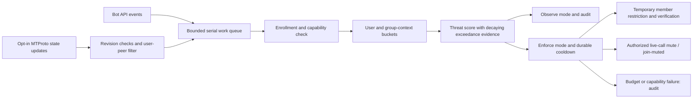

# Architecture and capability contract

## Observation and actuation boundaries

Bot API observations are group membership transitions, messages, callback queries, and call lifecycle/invitation service messages. These are application events. They are not UDP packets, call membership changes, or account registration dates. The optional MTProto adapter adds delivered live-call participant transitions for user identities, plus authorized call mute/join-muted actions. It opens no media connection, records no audio, and reads no chat history.

The official [Bot API schema](https://core.telegram.org/bots/api) lists update and permission types. [Participant constructors](https://core.telegram.org/constructor/groupCallParticipant) describe the distinct call state. [Participant mute](https://core.telegram.org/method/phone.editGroupCallParticipant) and [join-muted](https://core.telegram.org/method/phone.toggleGroupCallSettings) are user-only methods. Neither the Bot API nor [MTProto user schema](https://core.telegram.org/constructor/user) provides a trustworthy registration timestamp.

## Pipeline

## Scoring model

Let `b` be remaining tokens, `C` capacity, `r` refill tokens/second, `dt` seconds since the previous event, and `c` the cost. Pre-consumption tokens are `b_pre=min(C,b+r*dt)`; exceedance is `e=1[b_pre<c]`; post-consumption tokens are `b=max(0,b_pre-c)`.

Decaying evidence is `s=min(20,max(0,s-dt/10)+e)`. Depletion is `D=1-b/C`; evidence is `S=min(1,s/3)`; group exceedance is `G`; recent observed membership/call join within 30 seconds is `J`; explicitly missing username is `P`. Unknown username contributes zero.

`T=round(min(100,35D+35S+20G+5J+5P))`.

Detection requires `T >= THREAT_THRESHOLD` and `s >= 2`. Missing username contributes at most five points and cannot independently produce a detection. Capacities/refill are configurable policy parameters; the score changes with observed behavior and group pressure. No trained classifier, packet-rate estimator, adaptive capacity learning, or account-age inference is implemented.

Costs: messages/buttons 1; group joins/leaves 4; live-call joins/leaves 4. The internal `vc_action` event class costs 2 but is reserved for future adapters with reliable actor attribution; the supplied adapter never emits it. Moderator-caused mute/volume changes are not charged to the target. Default ordinary user capacity/refill is 20/1, VC 24/4, group-context 80/10, threshold 65. Membership, ordinary actions and VC each have distinct buckets. A remembered group join can provide recent-join context to other event types.

## Mitigation behavior

- `NORMAL`: score below threshold, no action.
- `OBSERVED`: detection audited; observe mode causes no new remote moderation actions.
- `QUARANTINED`: an originally unrestricted member receives a temporary chat restriction. An owned challenge may lift it early after verification and any flood cooldown. Timeout lifts it through Telegram's native expiry.
- `VC_RESTRICTED`: an authorized user-admin mutes an identified current participant; optional join-muted policy is applied. Manual administrator restoration avoids automatically granting call privileges after state loss.
- `DEGRADED`: unavailable observations, version gaps, expired authority mapping or exhausted outbound budgets suppress remote action. Health/readiness and audit describe only the service state; they do not certify media availability.

This is a policy state model. It is represented by settings, challenges, cooldown records, and adapter capabilities rather than a single universal database status. Observe mode does not remove a pre-existing restriction; user-requested verification can still restore an owned chat restriction.

## Persistence, bounds, and delivery

Expiry is checked when reading challenges and deduplication records, independently of periodic cleanup. A database created by a newer schema is refused before initialization; running an older release cannot silently overwrite its schema version.

SQLite stores tenant settings, gate ownership, recent update IDs, cooldowns, and audit history using WAL and full synchronization. No message text, photos, phone number, or audio is written to the audit database. IDs remain personal data. Default retention is seven days, with once-per-minute expiry cleanup; database pages and backups can retain deleted content until maintenance/rotation.

Each in-memory map has an explicit entry bound and idle expiry. The queue holds at most 2,000 application tasks. Bot API polling is sequential; the MTProto update handler posts bounded tasks without awaiting them, avoiding a response-dispatch deadlock. Queue shedding, budget drops, API failures and capacity eviction reduce coverage and are measurable limitations. Restart resets bucket evidence, creating a warm-up window.

Default API budget is 20 global burst calls with 5 calls/second refill and 5 per-chat burst calls with 1 call/second refill. Bot API and MTProto have separate budgets. Fresh admin checks also consume the budget. A server `retry_after`/FloodWait pauses that adapter's API activity. There is no unbounded retry loop. A durable 60-second per-user detection cooldown reduces repeated action amplification. A failed action is audited rather than represented as successful mitigation.

Polling updates older than two minutes are skipped for moderation. Completed update IDs are retained for 24 hours. This is bounded duplicate suppression, not exactly-once transactional delivery across Telegram and SQLite. Native restriction expiry protects members after bot downtime. Pending restriction intent is persisted before the API call to handle lost acknowledgements.

## VC adapter limitations

A revision gap invalidates the cached call snapshot before resynchronization. Failed resynchronization leaves call actions unavailable until a fresh snapshot is obtained; status output also identifies stale call state.

The operator's account must already belong to each allowlisted group and hold call-management rights. No automatic join or account privilege acquisition occurs. The adapter discovers calls periodically and when service/state updates arrive. Account dialog cache warming is bounded; groups outside that cache may need to be opened in the account's Telegram client before setup. Many enrolled VC groups can exhaust discovery budgets; this version is not a horizontally scaled SaaS voice gateway.

Call revisions follow the documented same-revision/next-revision distinction. A gap triggers immediate conservative resynchronization and suppresses the questionable update; this deliberately omits Telegram's optional one-second wait for missing revisions. Reconciliation does not reconstruct missing abuse events. Fresh group rights and active participant lookup are required before mutation. Call access hashes and account session strings stay out of logs. RTMP, scheduled calls, conference calls and channel-as-user peers are unsupported.

Just-joined/left events can reflect transport reconnects or other actors. They establish churn, not malicious intent. Raw packet rate is unobserved. Forcible mute constrains permitted publishing according to Telegram behavior; it does not necessarily prevent reconnect signaling, arbitrary UDP transmission, video effects, server-side exhaustion or a pre-existing client crash. Never report an RPC acknowledgement as packet-filtering effectiveness.

## Threat model and trust

In scope: attributable excessive application events in an enrolled supergroup, including supplied direct-call state churn. Trusted: current Telegram permission results, local operator configuration, and secret-bearing account process. Out of scope: malicious administrators, compromised operator/session, attacks with no observable events, provider/upstream DDoS, zero-day client vulnerabilities and Sybil populations that remain below each identity's budget. Group pressure alone is insufficient to restrict a quiet individual.

Chat verification checks the current member's restriction expiry and visible permission vector before lifting it. Telegram provides no compare-and-swap permission mutation, so concurrent moderator changes between read and write remain a documented race. Keep one moderation authority for automatic early restoration, or rely on natural expiry where competing moderation tools operate.
