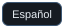
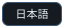
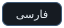
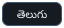

<p align="center"></p>

# Sentinel-VC — Türkçe

<!-- languages:start -->
<p align="center" dir="ltr">
<a href="../../README.md" title="English"></a><a href="../../README.bn.md" title="বাংলা"></a><a href="README.zh-CN.md" title="中文"></a><a href="README.hi.md" title="हिन्दी"></a><a href="README.es.md" title="Español"></a><a href="README.ar.md" title="العربية"></a><a href="README.fr.md" title="Français"></a><a href="README.pt.md" title="Português"></a><a href="README.id.md" title="Bahasa Indonesia"></a><a href="README.ur.md" title="اردو"></a><br>
<a href="README.ru.md" title="Русский"></a><a href="README.ko.md" title="한국어"></a><a href="README.ja.md" title="日本語"></a><a href="README.de.md" title="Deutsch"></a><a href="README.tr.md" title="Türkçe"></a><a href="README.it.md" title="Italiano"></a><a href="README.fa.md" title="فارسی"></a><a href="README.vi.md" title="Tiếng Việt"></a><a href="README.ta.md" title="தமிழ்"></a><a href="README.te.md" title="తెలుగు"></a>
</p>
<!-- languages:end -->

## Kullanım kılavuzu

[@sentinelvcbot](https://t.me/sentinelvcbot) · [Güncellemeler](https://t.me/sentinelvc)

/start → /language → Türkçe

1. Botu süpergruba üye kısıtlama yetkisi olan yönetici olarak ekleyin.

2. Grupta birkaç saniye arayla /setup, /doctor ve /status gönderin.

3. Gözlem modunda /incidents kayıtlarını inceleyin; hazır olduğunuzda /mode enforce kullanın. /gate on yeni üyeleri doğrular.

4. Kısıtlanırsanız görevdeki grup kimliğiyle özel sohbette /verify GROUP_ID gönderin.

Ses kontrolü ayrı bir isteğe bağlı adaptör gerektirir. Ham UDP ve hesap oluşturma tarihleri kullanılamaz.

## Gruba ekle

[Telegram](https://t.me/sentinelvcbot?startgroup=setup)

## VPS / Docker

[Self-hosting guide (English)](../SELF_HOSTING.md) · [Voice setup (English)](../VC_SETUP.md)

```bash
git clone https://github.com/thecmjhb/Sentinel-VC.git
cd Sentinel-VC
bash scripts/setup.sh
```

HTTP_PORT: 18765 → `bash scripts/setup.sh --port 19234`

```bash
docker compose logs --tail=50 sentinel
curl --fail "http://$(docker compose port sentinel 8080)/readyz"
```

[Kaynak kodu](https://github.com/thecmjhb/Sentinel-VC) · [MIT](../../LICENSE) · [Privacy (English)](../../PRIVACY.md)

C. M. Jubayer Hossain Bappy
